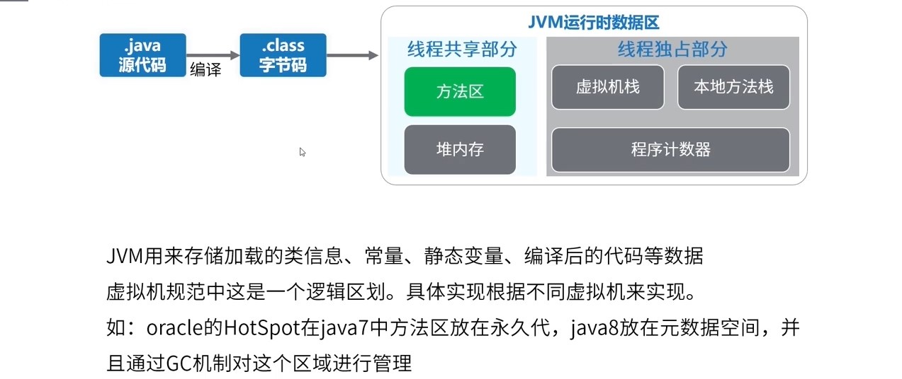

# 1.1.1 Java程序运行原理分析

## JVM运行时的内存分布
class文件被加载到内存中，放在<b>方法区中</b>
如图

JVM运行时的内存分布如图
### 方法区
用来存储加载的类信息，常量，静态变量和编译后的代码等数据，oracle的HotSpot在java中方法区放在永久代，java8放在元数据空间，并且通过GC机制对这个区域进行管理。
### 堆内存
堆内存还可以分为老年代、新生代。新生代又可以分为Eden、S0、S1，如果满了会出现OOM异常，这里是主要存放Java对象的地方。

