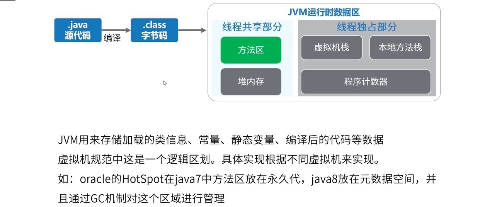
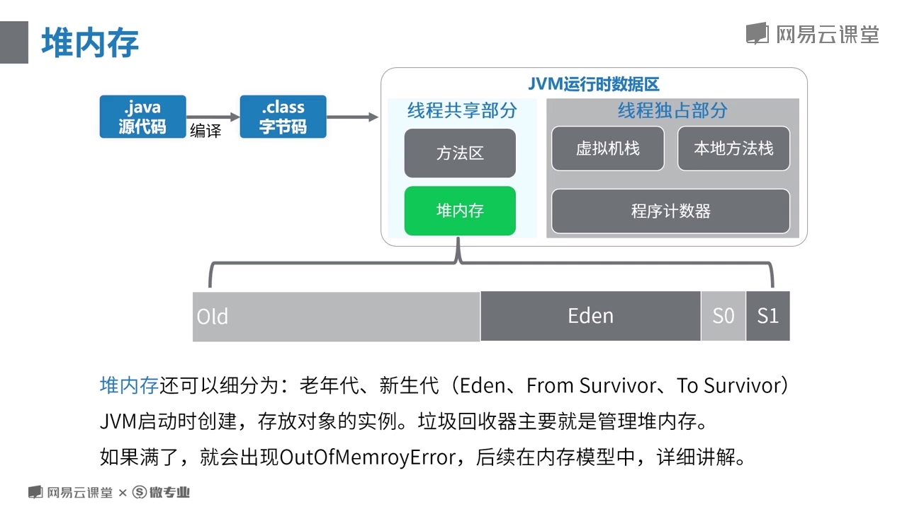
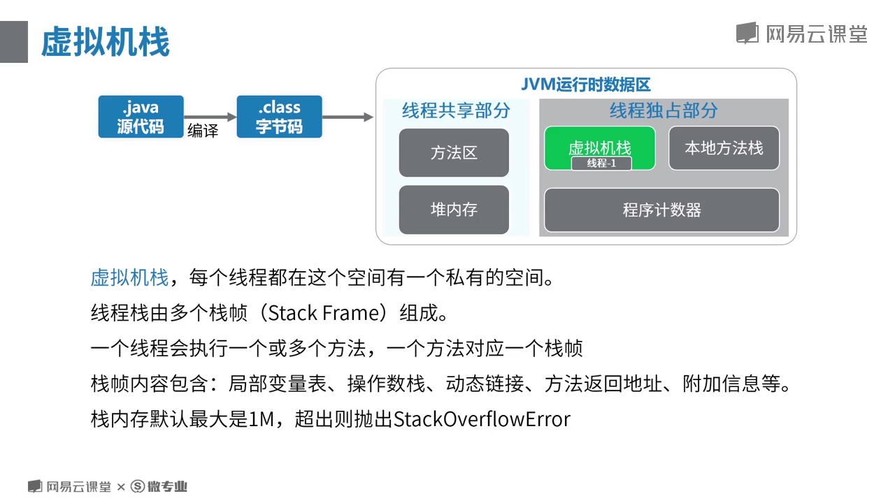

# 1.1.1 Java程序运行原理分析

## JVM运行时的内存分布
class文件被加载到内存中，放在<b>方法区中</b>
如图

JVM运行时的内存分布如图
### 方法区
用来存储加载的类信息，常量，静态变量和编译后的代码等数据，oracle的HotSpot在java中方法区放在永久代，java8放在元数据空间，并且通过GC机制对这个区域进行管理。
### 堆内存
堆内存还可以分为老年代、新生代。新生代又可以分为Eden、S0、S1，如果满了会出现OOM异常，这里是主要存放Java对象的地方。


### 堆内存和方法区是所有线程都能访问的

### 只能某个线程自己访问的内存分别为虚拟机栈、本地方法栈和程序计数器。

### 虚拟机栈
虚拟机栈由多个栈帧组成，一个线程会执行一个或者多个方法，一个方法对应一个栈帧。
栈帧又包含：局部变量表，操作数栈，动态链接，方法返回地址等
默认栈大小是1M，超出则会跑出StackOverFlowError。


### 本地方法栈
本地方法栈是为虚拟机使用Native本地方法而准备的。


### 程序计数器
记录当前线程执行字节码的位置，如果是执行Native方法，则计数器值为空。占用很少的内存，在多线程来回切换执行的时候记录下当前线程运行到的代码位置。


## 以Hello.java文件的执行为例子
```java
class Hello{
    public static void main(String[] args) {
        int x = 500;
        int y = 100;
        int a = x/y;
        int b = 50;
        System.out.println(a+b);
    }
}
```
*.java先被JDK提供的javac编译工具编译成
*.class文件，然后再由对应的ClassLoader（类加载器）加载到JVM运行时内存中


通过命令可以将源码反编译成机器码
> javap -v Hello.class > Hello.txt


```java
Classfile /C:/Users/pikzas/Desktop/Hello.class
  Last modified 2020-4-13; size 414 bytes
  MD5 checksum 0cf642cc903b4a34cc0bfd9e37612f51
  Compiled from "Hello.java"
class Hello
  SourceFile: "Hello.java"
  minor version: 0
  major version: 51
  flags: ACC_SUPER

Constant pool:
   #1 = Methodref          #5.#14         
   //  java/lang/Object."<init>":()V
   #2 = Fieldref           #15.#16        
   //  java/lang/System.out:Ljava/io/PrintStream;
   #3 = Methodref          #17.#18        
   //  java/io/PrintStream.println:(I)V
   #4 = Class              #19            
   //  Hello
   #5 = Class              #20            
   //  java/lang/Object
   #6 = Utf8               <init>
   #7 = Utf8               ()V
   #8 = Utf8               Code
   #9 = Utf8               LineNumberTable
  #10 = Utf8               main
  #11 = Utf8               ([Ljava/lang/String;)V
  #12 = Utf8               SourceFile
  #13 = Utf8               Hello.java
  #14 = NameAndType        #6:#7          
  //  "<init>":()V
  #15 = Class              #21            
  //  java/lang/System
  #16 = NameAndType        #22:#23        
  //  out:Ljava/io/PrintStream;
  #17 = Class              #24            
  //  java/io/PrintStream
  #18 = NameAndType        #25:#26        
  //  println:(I)V
  #19 = Utf8               Hello
  #20 = Utf8               java/lang/Object
  #21 = Utf8               java/lang/System
  #22 = Utf8               out
  #23 = Utf8               Ljava/io/PrintStream;
  #24 = Utf8               java/io/PrintStream
  #25 = Utf8               println
  #26 = Utf8               (I)V
{
  Hello();
    flags: 

    Code:
      stack=1, locals=1, args_size=1
         0: aload_0       
         1: invokespecial #1                  
         // Method java/lang/Object."<init>":()V
         4: return        
      LineNumberTable:
        line 1: 0

  public static void main(java.lang.String[]);
    flags: ACC_PUBLIC, ACC_STATIC        
     // 访问控制

    Code:
      stack=3, locals=5, args_size=1      
      // 本地变量数量5 操作数栈的深度3 参数数量
         0: sipush        500
         3: istore_1      
         4: bipush        100
         6: istore_2      
         7: iload_1       
         8: iload_2       
         9: idiv          
        10: istore_3      
        11: bipush        50
        13: istore        4
        15: getstatic     #2                  
        // Field java/lang/System.out:Ljava/io/PrintStream;
        18: iload_3       
        19: iload         4
        21: iadd          
        22: invokevirtual #3                  
        // Method java/io/PrintStream.println:(I)V
        25: return        
      LineNumberTable:
        line 3: 0
        line 4: 4
        line 5: 7
        line 6: 11
        line 7: 15
        line 8: 25
}
```


