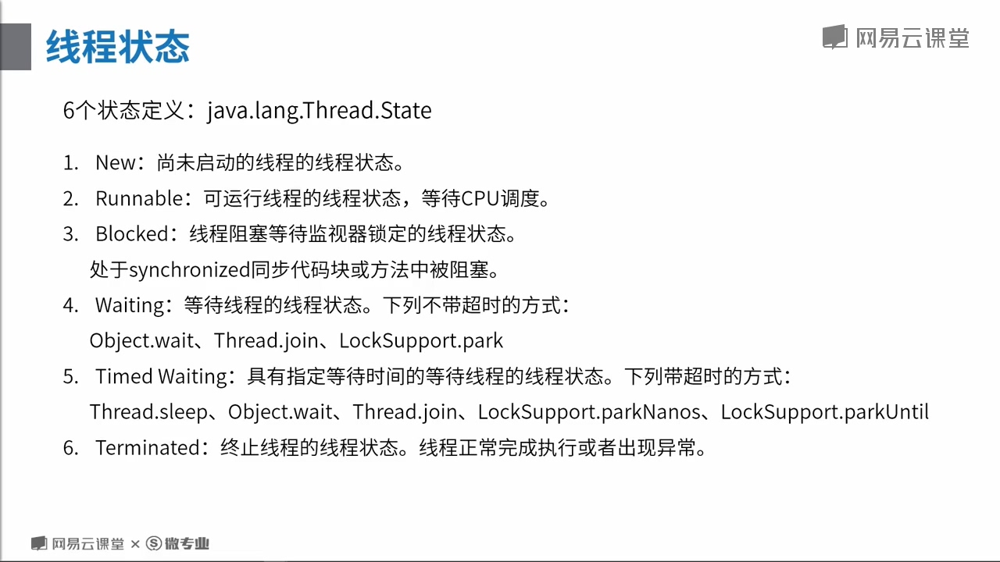
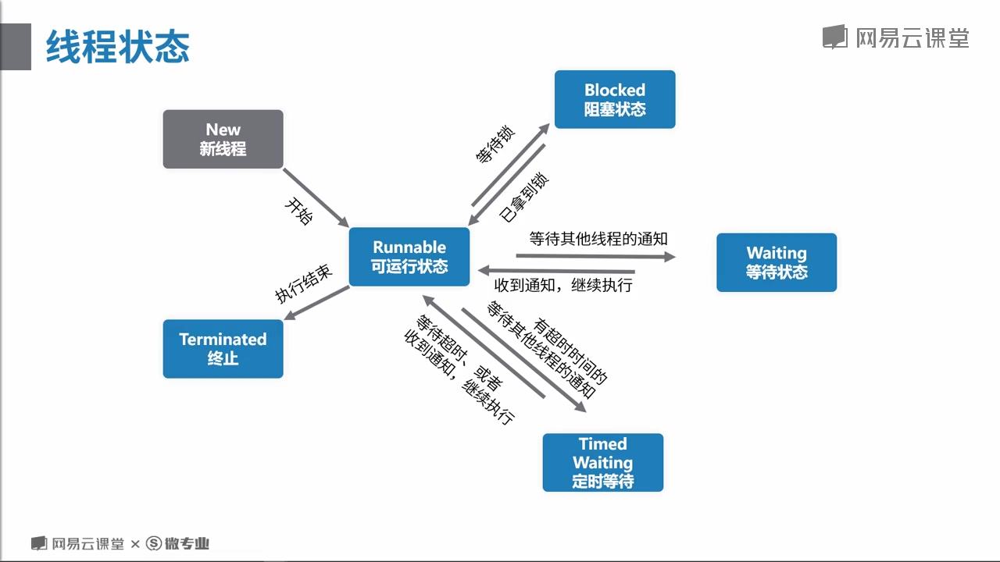

# 1.1.2 线程的状态


线程状态

状态的流转

```java
package com.pikzas;

public class Demo2 {
    public static Thread thread1;
    public static Demo2 obj;

    public static void main(String[] args) throws Exception {
        // 第一种状态切换 -新建-》运行-》终止
        System.out.println("#######第一种状态切换 -新建-》运行-》终止################################");
        Thread thread1 = new Thread(new Runnable() {
            @Override
            public void run() {
                System.out.println("thread1 当前状态 " + Thread.currentThread().getState().toString());
                System.out.println("thread1 running");
            }
        });
        System.out.println("没调用start的 thread1的状态" + thread1.getState().toString());
        thread1.start();
        Thread.sleep(2000L); // 主线程休息2s 让thread1跑完。
        System.out.println("thread1的状态" + thread1.getState().toString());
        // thread1.start(); 对于已经终止的线程再次掉用start()会抛出异常。

        System.out.println();
        System.out.println("########第二种状态切换 -> new -> runnable -> timed_waiting -> terminated ###########################");
        Thread thread2 = new Thread(new Runnable() {
            @Override
            public void run() {
                try {// 线程先睡1.5s
                    Thread.sleep(1500);
                } catch (InterruptedException e) {
                    e.printStackTrace();
                }
                System.out.println("thread2 当前状态" + Thread.currentThread().getState().toString());
                System.out.println("thread2 running");
            }
        });
        System.out.println("没调用start之前thread2线程的状态" + thread2.getState().toString());
        thread2.start();
        System.out.println("调用start之后thread2线程的状态" + thread2.getState().toString());
        Thread.sleep(200L);
        System.out.println("主线程睡了200ms之后thread2的状态" + thread2.getState().toString());
        Thread.sleep(3000L);
        System.out.println("主线程睡了3000ms之后thread2的状态" + thread2.getState().toString());

        System.out.println();
        System.out.println("############第三种状态切换  -> new -> runnable -> blocked -> running###########################");
        Thread thread3 = new Thread(new Runnable() {
            @Override
            public void run() {
                synchronized (Demo2.class) {
                    System.out.println("thread3 当前状态" + Thread.currentThread().getState().toString());
                    System.out.println("thread3 running");
                }
            }
        });
        synchronized (Demo2.class) {
            System.out.println("调用start之前thread3的状态" + thread3.getState().toString());
            thread3.start();
            System.out.println("调用start之后thread3的状态" + thread3.getState().toString());
            Thread.sleep(200L);
            System.out.println("主线程睡了200ms之后thread3的状态" + thread3.getState().toString());
        }
        Thread.sleep(3000L);
        System.out.println("主线程睡了3s之后thread3的状态" + thread3.getState().toString());

    }
}
//输出为
#######第一种状态切换 -新建-》运行-》终止################################
没调用start的 thread1的状态NEW
thread1 当前状态 RUNNABLE
thread1 running
thread1的状态TERMINATED

########第二种状态切换 -> new -> runnable -> timed_waiting -> terminated ###########################
没调用start之前thread2线程的状态NEW
调用start之后thread2线程的状态RUNNABLE
主线程睡了200ms之后thread2的状态TIMED_WAITING
thread2 当前状态RUNNABLE
thread2 running
主线程睡了3000ms之后thread2的状态TERMINATED

############第三种状态切换  -> new -> runnable -> blocked -> running###########################
调用start之前thread3的状态NEW
调用start之后thread3的状态RUNNABLE
主线程睡了200ms之后thread3的状态BLOCKED
thread3 当前状态RUNNABLE
thread3 running
主线程睡了3s之后thread3的状态TERMINATED
```


