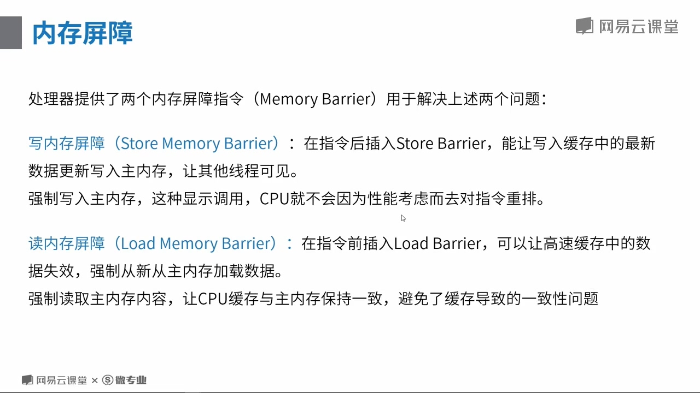

# 1.1.4 内存屏障和CPU缓存

## CPU的性能优化
1. CPU缓存
由于CPU的处理速度远大于内存的读写速度远大于硬盘的读写速度，所以CPU会利用自身的缓存来作为一个加速处理能力的优化手段，但是多核CPU，每个CPU都会有自己的缓存（L1 Cache,L2 Cache）造成了不同的CPU核心间处理同一份数据的时候可能会读取到过期数据的问题 

2. 运行时指令的重排 
重排发生的前提是遵循as-if-serial语义，即不会对存在数据依赖关系的操作做重排序。

## 优化带来的问题
鉴于CPU有以上两种优化的机制
<b>缓存</b>会导致同一时间点，各个CPU所看到同一内存地址的数据的值可能是不一致的。
<b>重排</b>保证的as-if-serial语义是针对单线程场景的，如果是多线程执行，重排则可能导致错误。

## 解决方法
所有的处理器厂商都有提供两个内存屏障指令来解决上述问题
1. 写内存屏障：Store Memory Barrier能让CPU核心写入CPU缓存中的最新数据更新到主内存，让其他线程可见。强制写入主内存，CPU不会因为性能考虑而再去对指令进行重排。
2. 读内存屏障：Load Memory Barrier能让CPU缓存中的数据失效，强制性的从主内存中重新加载数据，让CPU缓存与主内存的数据保持一致。

