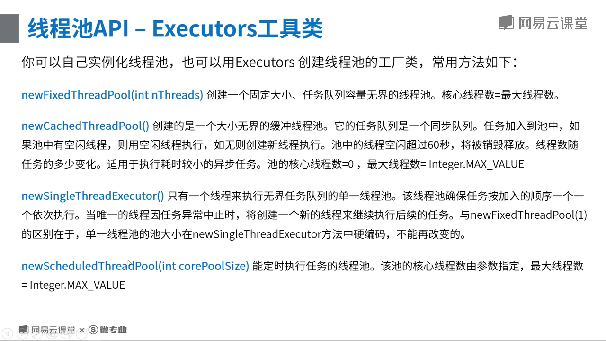
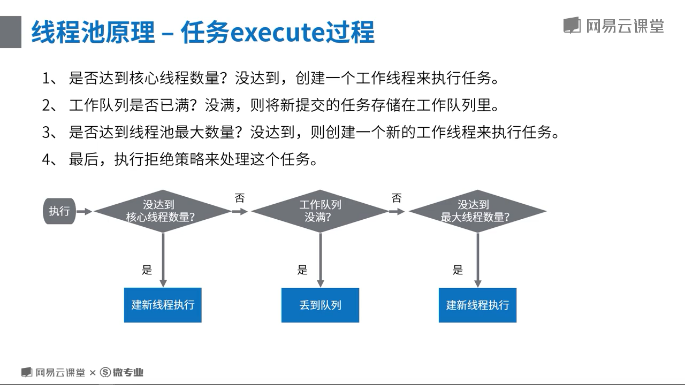
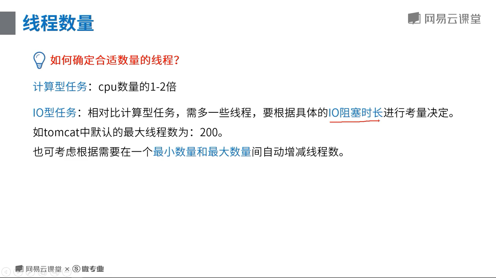

# 1.1.7 线程池原理

## 线程池的组成
1. 线程池管理器：线程池的创建，销毁和添加新任务。
2. 工作线程：线程池中的线程，没任务时候处于等待状态，可以循环执行任务。
3. 任务接口：每个任务必须要实现的接口，以供工作线程调度任务的执行，主要规定了任务的入口，任务执行完后的收尾工作，任务的执行状态等。
4. 任务队列：存放没有处理的任务。 

ScheduledExecutorService的两个定时执行任务的区别
1. scheduledAtFixedRate() 如果上一个任务的执行时间超过了设定的时间间隔，那么当上一个任务执行完毕之后，下一个任务立即执行。
2. scheduledWithFixedDelay() 如果上一个任务的执行时间超过了设定的时间间隔，那么当上一个任务执行完毕之后，下一个任务依旧要等待指定的时间间隔，然后再执行下一个任务。

## 线程池的使用示例
> 通用接口
```java
/**
     * 测试： 提交15个执行时间需要3秒的任务,看线程池的状况
     *
     * @param threadPoolExecutor 传入不同的线程池，看不同的结果
     * @throws Exception
     */
    public void testCommon(ThreadPoolExecutor threadPoolExecutor) throws Exception {
        // 测试： 提交15个执行时间需要3秒的任务，看超过大小的2个，对应的处理情况
        for (int i = 0; i < 15; i++) {
            int n = i;
            threadPoolExecutor.submit(new Runnable() {
                @Override
                public void run() {
                    try {
                        System.out.println("开始执行：" + n);
                        Thread.sleep(3000L);
                        System.err.println("执行结束:" + n);
                    } catch (InterruptedException e) {
                        e.printStackTrace();
                    }
                }
            });
            System.out.println("任务提交成功 :" + i);
        }
        // 查看线程数量，查看队列等待数量
        Thread.sleep(500L);
        System.out.println("当前线程池线程数量为：" + threadPoolExecutor.getPoolSize());
        System.out.println("当前线程池等待的数量为：" + threadPoolExecutor.getQueue().size());
        // 等待15秒，查看线程数量和队列数量（理论上，会被超出核心线程数量的线程自动销毁）
        Thread.sleep(15000L);
        System.out.println("当前线程池线程数量为：" + threadPoolExecutor.getPoolSize());
        System.out.println("当前线程池等待的数量为：" + threadPoolExecutor.getQueue().size());
    }
```

> 标准线程池
```java
    /**
     * 1、线程池信息： 核心线程数量5，最大数量10，无界队列，超出核心线程数量的线程存活时间：5秒， 指定拒绝策略的
     *
     * @throws Exception
     */
    private void threadPoolExecutorTest1() throws Exception {
        ThreadPoolExecutor threadPoolExecutor = new ThreadPoolExecutor(5, 10, 5, TimeUnit.SECONDS,
                new LinkedBlockingQueue<Runnable>());
        testCommon(threadPoolExecutor);
        // 预计结果：线程池线程数量为：5,超出数量的任务，其他的进入队列中等待被执行
    }
// 输出结果
任务提交成功 :0
开始执行：0
任务提交成功 :1
开始执行：1
任务提交成功 :2
开始执行：2
任务提交成功 :3
开始执行：3
任务提交成功 :4
任务提交成功 :5
开始执行：4
任务提交成功 :6
任务提交成功 :7
任务提交成功 :8
任务提交成功 :9
任务提交成功 :10
任务提交成功 :11
任务提交成功 :12
任务提交成功 :13
任务提交成功 :14
当前线程池线程数量为：5
当前线程池等待的数量为：10
开始执行：5
执行结束:1
开始执行：6
执行结束:3
开始执行：7
执行结束:2
开始执行：8
执行结束:4
开始执行：9
执行结束:0
执行结束:6
执行结束:8
执行结束:9
执行结束:7
执行结束:5
开始执行：10
开始执行：11
开始执行：12
开始执行：13
开始执行：14
执行结束:10
执行结束:14
执行结束:13
执行结束:12
执行结束:11
当前线程池线程数量为：5
当前线程池等待的数量为：0
```
> 可以看到几个关键点是，分明一次提交了15个任务，但是并没有开辟15个线程来运行，仅仅是使用了5个核心线程来处理任务。多出的任务都被塞到了队列中等待处理。

## Executors 工具类


## 线程池执行原理


### 拒绝策略演示
```java
 /**
     * 2、 线程池信息： 核心线程数量5，最大数量10，队列大小3，超出核心线程数量的线程存活时间：5秒， 指定拒绝策略的
     *
     * @throws Exception
     */
    private void threadPoolExecutorTest2() throws Exception {
        // 创建一个 核心线程数量为5，最大数量为10,等待队列最大是3 的线程池，也就是最大容纳13个任务。
        // 默认的策略是抛出RejectedExecutionException异常，java.util.concurrent.ThreadPoolExecutor.AbortPolicy
        ThreadPoolExecutor threadPoolExecutor = new ThreadPoolExecutor(5, 10, 5, TimeUnit.SECONDS,
                new LinkedBlockingQueue<Runnable>(3), new RejectedExecutionHandler() {
            @Override
            public void rejectedExecution(Runnable r, ThreadPoolExecutor executor) {
                System.err.println("有任务被拒绝执行了");
            }
        });
        testCommon(threadPoolExecutor);
        // 预计结果：
        // 1、 5个任务直接分配线程开始执行
        // 2、 3个任务进入等待队列
        // 3、 队列不够用，临时加开5个线程来执行任务(5秒没活干就销毁)
        // 4、 队列和线程池都满了，剩下2个任务，没资源了，被拒绝执行。
        // 5、 任务执行，5秒后，如果无任务可执行，销毁临时创建的5个线程
    }
// 输出 结果符合预计
任务提交成功 :0
有任务被拒绝执行了
开始执行：0
有任务被拒绝执行了
任务提交成功 :1
开始执行：1
任务提交成功 :2
开始执行：2
任务提交成功 :3
开始执行：3
任务提交成功 :4
开始执行：4
任务提交成功 :5
任务提交成功 :6
任务提交成功 :7
任务提交成功 :8
开始执行：8
任务提交成功 :9
开始执行：9
任务提交成功 :10
开始执行：10
任务提交成功 :11
开始执行：11
任务提交成功 :12
任务提交成功 :13
开始执行：12
任务提交成功 :14
当前线程池线程数量为：10
当前线程池等待的数量为：3
开始执行：5
执行结束:4
执行结束:3
执行结束:1
开始执行：6
执行结束:8
开始执行：7
执行结束:11
执行结束:12
执行结束:0
执行结束:9
执行结束:2
执行结束:10
执行结束:6
执行结束:5
执行结束:7
当前线程池线程数量为：5
当前线程池等待的数量为：0
```

### SynchronousQueue 构成的线程池，不能存储任务到队列中，会立即加开线程。但是注意控制好线程的上限。
```java
    /**
     * 4、 线程池信息：
     * 核心线程数量0，最大数量Integer.MAX_VALUE，SynchronousQueue队列，超出核心线程数量的线程存活时间：60秒
     *
     * @throws Exception
     */
    private void threadPoolExecutorTest4() throws Exception {

        // SynchronousQueue，实际上它不是一个真正的队列，因为它不会为队列中元素维护存储空间。与其他队列不同的是，它维护一组线程，这些线程在等待着把元素加入或移出队列。
        // 在使用SynchronousQueue作为工作队列的前提下，客户端代码向线程池提交任务时，
        // 而线程池中又没有空闲的线程能够从SynchronousQueue队列实例中取一个任务，
        // 那么相应的offer方法调用就会失败（即任务没有被存入工作队列）。
        // 此时，ThreadPoolExecutor会新建一个新的工作者线程用于对这个入队列失败的任务进行处理（假设此时线程池的大小还未达到其最大线程池大小maximumPoolSize）。

        // 和Executors.newCachedThreadPool()一样的
        ThreadPoolExecutor threadPoolExecutor = new ThreadPoolExecutor(0, Integer.MAX_VALUE, 60L, TimeUnit.SECONDS,
                new SynchronousQueue<Runnable>());
        testCommon(threadPoolExecutor);
        // 预计结果：
        // 1、 线程池线程数量为：15，超出数量的任务，其他的进入队列中等待被执行
        // 2、 所有任务执行结束，60秒后，如果无任务可执行，所有线程全部被销毁，池的大小恢复为0
        Thread.sleep(60000L);
        System.out.println("60秒后，再看线程池中的数量：" + threadPoolExecutor.getPoolSize());
    }
```

### 定时任务的执行
```java
    /**
     * 5、 定时执行线程池信息：3秒后执行，一次性任务，到点就执行 <br/>
     * 核心线程数量5，最大数量Integer.MAX_VALUE，DelayedWorkQueue延时队列，超出核心线程数量的线程存活时间：0秒
     *
     * @throws Exception
     */
    private void threadPoolExecutorTest5() throws Exception {
        // 和Executors.newScheduledThreadPool()一样的
        ScheduledThreadPoolExecutor threadPoolExecutor = new ScheduledThreadPoolExecutor(5);
        threadPoolExecutor.schedule(new Runnable() {
            @Override
            public void run() {
                System.out.println("任务被执行，现在时间：" + System.currentTimeMillis());
            }
        }, 3000, TimeUnit.MILLISECONDS);
        System.out.println(
                "定时任务，提交成功，时间是：" + System.currentTimeMillis() + ", 当前线程池中线程数量：" + threadPoolExecutor.getPoolSize());
        // 预计结果：任务在3秒后被执行一次
    }
```

### 定时任务的循环执行
```java
/**
     * 6、 定时执行线程池信息：线程固定数量5 ，<br/>
     * 核心线程数量5，最大数量Integer.MAX_VALUE，DelayedWorkQueue延时队列，超出核心线程数量的线程存活时间：0秒
     *
     * @throws Exception
     */
    private void threadPoolExecutorTest6() throws Exception {
        ScheduledThreadPoolExecutor threadPoolExecutor = new ScheduledThreadPoolExecutor(5);
        // 周期性执行某一个任务，线程池提供了两种调度方式，这里单独演示一下。测试场景一样。
        // 测试场景：提交的任务需要3秒才能执行完毕。看两种不同调度方式的区别
        // 效果1： 提交后，2秒后开始第一次执行，之后每间隔1秒，固定执行一次(如果发现上次执行还未完毕，则等待完毕，完毕后立刻执行)。
        // 也就是说这个代码中是，3秒钟执行一次（计算方式：每次执行三秒，间隔时间1秒，执行结束后马上开始下一次执行，无需等待）
        threadPoolExecutor.scheduleAtFixedRate(new Runnable() {
            @Override
            public void run() {
                try {
                    Thread.sleep(3000L);
                } catch (InterruptedException e) {
                    e.printStackTrace();
                }
                System.out.println("任务-1 被执行，现在时间：" + System.currentTimeMillis());
            }
        }, 2000, 1000, TimeUnit.MILLISECONDS);

        // 效果2：提交后，2秒后开始第一次执行，之后每间隔1秒，固定执行一次(如果发现上次执行还未完毕，则等待完毕，等上一次执行完毕后再开始计时，等待1秒)。
        // 也就是说这个代码钟的效果看到的是：4秒执行一次。 （计算方式：每次执行3秒，间隔时间1秒，执行完以后再等待1秒，所以是 3+1）
        threadPoolExecutor.scheduleWithFixedDelay(new Runnable() {
            @Override
            public void run() {
                try {
                    Thread.sleep(3000L);
                } catch (InterruptedException e) {
                    e.printStackTrace();
                }
                System.out.println("任务-2 被执行，现在时间：" + System.currentTimeMillis());
            }
        }, 2000, 1000, TimeUnit.MILLISECONDS);
    }
```

### 线程池的终止
1. shutdown() 追加的任务不能在提交，已提交的任务依旧可以跑。
2. shutdownNow 立即终止所有任务的执行，返回被终止的线程集合。
```java
    /**
     * 7、 终止线程：线程池信息： 核心线程数量5，最大数量10，队列大小3，超出核心线程数量的线程存活时间：5秒， 指定拒绝策略的
     *
     * @throws Exception
     */
    private void threadPoolExecutorTest7() throws Exception {
        // 创建一个 核心线程数量为5，最大数量为10,等待队列最大是3 的线程池，也就是最大容纳13个任务。
        // 默认的策略是抛出RejectedExecutionException异常，java.util.concurrent.ThreadPoolExecutor.AbortPolicy
        ThreadPoolExecutor threadPoolExecutor = new ThreadPoolExecutor(5, 10, 5, TimeUnit.SECONDS,
                new LinkedBlockingQueue<Runnable>(3), new RejectedExecutionHandler() {
            @Override
            public void rejectedExecution(Runnable r, ThreadPoolExecutor executor) {
                System.err.println("有任务被拒绝执行了");
            }
        });
        // 测试： 提交15个执行时间需要3秒的任务，看超过大小的2个，对应的处理情况
        for (int i = 0; i < 15; i++) {
            int n = i;
            threadPoolExecutor.submit(new Runnable() {
                @Override
                public void run() {
                    try {
                        System.out.println("开始执行：" + n);
                        Thread.sleep(3000L);
                        System.err.println("执行结束:" + n);
                    } catch (InterruptedException e) {
                        System.out.println("异常：" + e.getMessage());
                    }
                }
            });
            System.out.println("任务提交成功 :" + i);
        }
        // 1秒后终止线程池
        Thread.sleep(1000L);
        threadPoolExecutor.shutdown();
        // 再次提交提示失败
        threadPoolExecutor.submit(new Runnable() {
            @Override
            public void run() {
                System.out.println("追加一个任务");
            }
        });
        // 结果分析
        // 1、 10个任务被执行，3个任务进入队列等待，2个任务被拒绝执行
        // 2、调用shutdown后，不接收新的任务，等待13任务执行结束
        // 3、 追加的任务在线程池关闭后，无法再提交，会被拒绝执行
    }

    /**
     * 8、 立刻终止线程：线程池信息： 核心线程数量5，最大数量10，队列大小3，超出核心线程数量的线程存活时间：5秒， 指定拒绝策略的
     *
     * @throws Exception
     */
    private void threadPoolExecutorTest8() throws Exception {
        // 创建一个 核心线程数量为5，最大数量为10,等待队列最大是3 的线程池，也就是最大容纳13个任务。
        // 默认的策略是抛出RejectedExecutionException异常，java.util.concurrent.ThreadPoolExecutor.AbortPolicy
        ThreadPoolExecutor threadPoolExecutor = new ThreadPoolExecutor(5, 10, 5, TimeUnit.SECONDS,
                new LinkedBlockingQueue<Runnable>(3), new RejectedExecutionHandler() {
            @Override
            public void rejectedExecution(Runnable r, ThreadPoolExecutor executor) {
                System.err.println("有任务被拒绝执行了");
            }
        });
        // 测试： 提交15个执行时间需要3秒的任务，看超过大小的2个，对应的处理情况
        for (int i = 0; i < 15; i++) {
            int n = i;
            threadPoolExecutor.submit(new Runnable() {
                @Override
                public void run() {
                    try {
                        System.out.println("开始执行：" + n);
                        Thread.sleep(3000L);
                        System.err.println("执行结束:" + n);
                    } catch (InterruptedException e) {
                        System.out.println("异常：" + e.getMessage());
                    }
                }
            });
            System.out.println("任务提交成功 :" + i);
        }
        // 1秒后终止线程池
        Thread.sleep(1000L);
        List<Runnable> shutdownNow = threadPoolExecutor.shutdownNow();
        // 再次提交提示失败
        threadPoolExecutor.submit(new Runnable() {
            @Override
            public void run() {
                System.out.println("追加一个任务");
            }
        });
        System.out.println("未结束的任务有：" + shutdownNow.size());

        // 结果分析
        // 1、 10个任务被执行，3个任务进入队列等待，2个任务被拒绝执行
        // 2、调用shutdownnow后，队列中的3个线程不再执行，10个线程被终止
        // 3、 追加的任务在线程池关闭后，无法再提交，会被拒绝执行
    }
```

## 确定合理的线程数量
